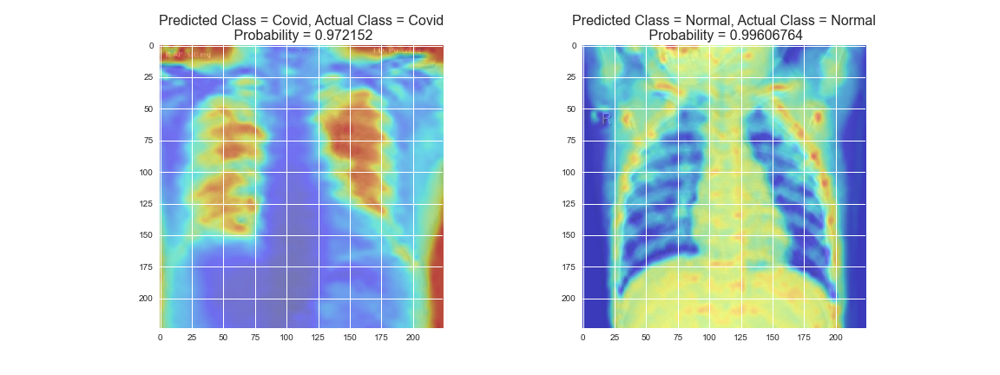

# Covid Detection with XRay Images

**Project summary:** This project is a classification project on X-ray and CT images. This project is build to detect whether the patient is covid positive or not. A common Dataset has build by merging to datasets for this project . One dataset contains all types of **Covid** X-ray images ( `COVID-19`, `SARS`, `MARS`, `ARDS`) and another dataset contains **Non-covid** X-ray images (`Normal`, `Pneumonia`)

In this project, we will use only 2 image class .
1. `Normal Cases`
2. `Covid Cases (COVID-19)`

Inspired by the recent paper [COVID-Net: A Tailored Deep Convolutional Neural Network Design for Detection of COVID-19 Cases from Chest Radiography Images](https://arxiv.org/pdf/2003.09871.pdf) and its Tensorflow [implementation](https://github.com/lindawangg/COVID-Net). 
COVID-Next features an architecture that builds upon the famous ResNext50 architecture, which has around **5x** less parameters than the original COVID-Net, and achieves comparable performance.

### Requirements

Code was tested with Python 3.8.3.
- `Dependencies/Packages`:
	- Tensorflow 2.x
	- Keras 2.x
	- matplotlib
	- seaborn
	- numpy
	- pandas
	- scikit-learn
	- Jupyter Notebook

You can install above packages by the following command:
`pip install [package-name] --user`

### Pretrained Model

Due to low resource of hardware, we have used `VGG16` as our pre-trained model.
You can download the pretrained COVID-Next model from [here](https://drive.google.com/open?id=1G8vQKBObt52b4qe5cQdoQkdPxjZK3ucI).

### Dataset Generate

1. Chest X-Ray Images (Pneumonia) [dataset](https://www.kaggle.com/paultimothymooney/chest-xray-pneumonia)
2. COVID-19 chest xray [dataset](https://www.kaggle.com/bachrr/covid-chest-xray)

3. After Downloading both datasets, placed it in `Chest_XRAY` & `Covid_XRAY`.
4. Then run Jupyter notebook `Create Data.ipynb`.

### Results

This Model has trained on Total - 273 images and tested on total - 64 images
|                   | Accuracy 	| F1 	| Precision | Recall 	|
|:-----------------:|:---------:|:-----:|:---------:|:---------:|
| CNN (Scratch)		| 97.06		| -		| -			| -			|
| VGG16   			| 98.24  	| - 	| - 		| - 		|

### Class Activation Maps(CAM):
Class Activation Maps for a particular category indicates the discriminative region used by CNN to identify the category. CAM is one of the most popular visualization among CNN visualization. More about Class Activation Maps: https://towardsdatascience.com/demystifying-convolutional-neural-networks-using-class-activation-maps-fe94eda4cef1

#### Some sample Class Activation Maps that are generated by CNN (Scratch). 

	